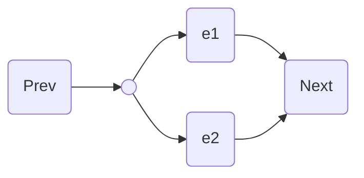

## Test Section

Test content[^ test] Lorem ipsum dolor sit amet, consectetur adipiscing elit.
Aenean nibh nisi, egestas non augue id, lobortis volutpat eros. In semper
placerat pretium.  Maecenas tempor, eros vitae scelerisque congue, tortor augue
maximus diam, a rutrum lorem ligula nec lacus. Sed sit amet semper lorem. Aenean
sit amet lobortis tellus, et facilisis ligula. Mauris luctus massa eu sem tempor
consequat. Nulla rhoncus aliquet velit, elementum egestas libero mattis eu.



Lorem ipsum dolor sit amet, consectetur adipiscing elit. Aenean nibh nisi,
egestas non augue id, lobortis volutpat eros. In semper placerat pretium.
Maecenas tempor, eros vitae scelerisque congue, tortor augue maximus diam, a
rutrum lorem ligula nec lacus. Sed sit amet semper lorem. Aenean sit amet
lobortis tellus, et facilisis ligula. Mauris luctus massa eu sem tempor
consequat. Nulla rhoncus aliquet velit, elementum egestas libero mattis eu.


```haskell
matchStream :: Regex -> String -> [String]
matchStream (Empty) syms        = [syms]
matchStream (Lit _) []          = []
matchStream (Lit c) (sym:syms)  = if c == sym then [syms] else []
matchStream (And re re') syms   = matchStream re syms >>= matchStream re'
matchStream (Or re re')  syms   = matchStream re syms <> matchStream re' syms
matchStream (Mark re)    syms   = matchStream re syms <> [syms]
matchStream (Plus re)    syms   = matchStream re syms >>= matchStream (Star re)
matchStream star@(Star re) syms = (<> [syms]) do
    syms' <- matchStream re syms
    if syms' /= syms then matchStream star syms' else []
```

Cras et nisi consequat, egestas augue in, cursus elit. Nulla convallis quam et
ligula venenatis, vulputate iaculis metus auctor. Mauris mattis, urna non
facilisis porttitor, urna nulla vehicula sem, a sodales metus quam a enim. Cras
erat odio, vulputate eget euismod nec, efficitur sed tellus. Nulla et nisi a
libero tempor porta in sed lacus. Sed hendrerit dapibus accumsan. Morbi dolor
metus, efficitur in diam eu, accumsan consequat nibh. Nam finibus lobortis est,
vel fringilla elit sagittis quis. Nullam egestas, nibh quis aliquet dapibus, sem
risus aliquam ante, vitae gravida magna turpis et purus. Ut nec odio quam.
Nullam ullamcorper blandit nisl, sed tempus turpis euismod quis. Vestibulum
faucibus, mauris sit amet commodo sollicitudin, mauris dui hendrerit ligula, ac
maximus purus erat non nunc. Quisque varius vestibulum tortor, ac interdum quam
eleifend nec. Aliquam auctor sem dictum, convallis urna ut, vulputate lorem.

```javascript
console.log("hello world")
```

Cras et nisi consequat[^ egestas augue in, cursus elit]. Nulla convallis quam et
ligula venenatis, vulputate iaculis metus auctor. Mauris mattis, urna non
facilisis porttitor, urna nulla vehicula sem, a sodales metus quam a enim. Cras
erat odio, vulputate eget euismod nec, efficitur sed tellus. Nulla et nisi a
libero tempor porta in sed lacus. Sed hendrerit dapibus accumsan. Morbi dolor
metus, efficitur in diam eu, accumsan consequat nibh. Nam finibus lobortis est,
vel fringilla elit sagittis quis. Nullam egestas, nibh quis aliquet dapibus, sem
risus aliquam ante, vitae gravida magna turpis et purus. Ut nec odio quam.
Nullam ullamcorper blandit nisl, sed tempus turpis euismod quis. Vestibulum
faucibus, mauris sit amet commodo sollicitudin, mauris dui hendrerit ligula, ac
maximus purus erat non nunc. Quisque varius vestibulum tortor, ac interdum quam
eleifend nec. Aliquam auctor sem dictum, convallis urna ut, vulputate lorem.
